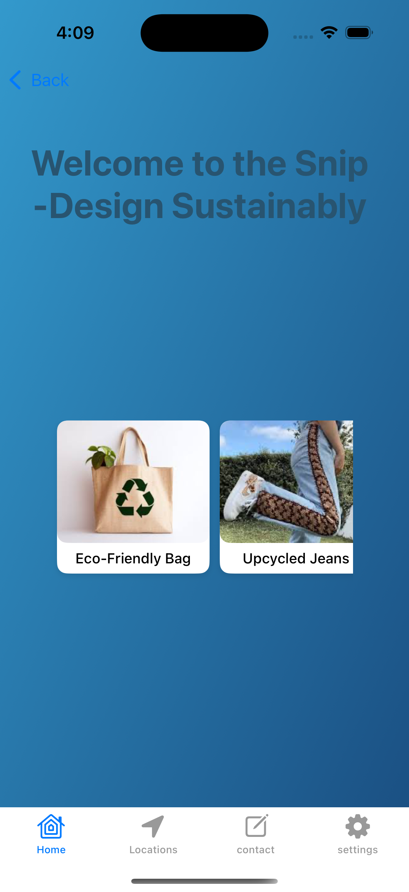
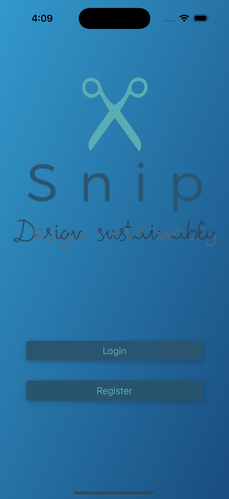

# SnipApp

**SnipApp** is an iOS application built using **UIKit** and **SwiftUI** in the **Swift** programming language. It emphasizes **design sustainability**, offering users an intuitive and visually appealing interface to explore eco-friendly and sustainable designs.

---

## Features

### 1. Login & Registration
- **Login**: Access the app's main features by logging in.
- **Registration**: New users can register through a seamless UI.

### 2. Home Screen
- A welcoming screen displaying the app’s theme of sustainability.

### 3. Tab Bar Navigation
- **Home**: View sustainable design concepts.
- **Locations**: Discover shop locations.
- **Contact**: Reach out for more information.
- **Settings**: Customize preferences.

---

## Screenshots
### Welcome Screen


### Login Screen



---

## Video Demonstration


### Watch SnipApp in Action
<a href="SnipApp25/images/videoDemo.mov">
    
</a>

---

## Installation

1. Clone the repository:
   ```bash
   git clone https://github.com/DharmaMithraTirunagari/SnipApp.git
